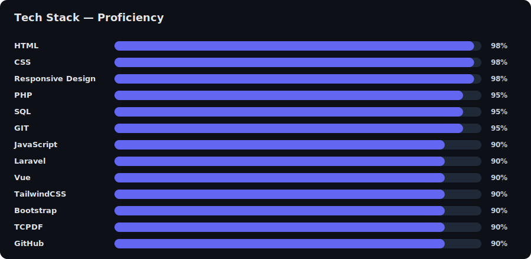

# Khemark Ocariza

Web Developer | Full Stack | Minimalist

---

👋 Hi, I'm Khemark — I craft seamless digital experiences, blending design and functionality for the web. I love building both the front-end and back-end of web applications, always with a focus on clarity, usability, and impact.

---

## ✨ Projects

- **[Coolfolio](https://faithan.github.io/Coolfolio/):** Minimalist portfolio to showcase my growth, skills, and projects as a developer.
- **[Royale](https://faithan.github.io/Coolfolio/):** Online request and order system for Royale Tailoring (BSCS Capstone).
- **[Estregan Beach Resort](https://faithan.github.io/Coolfolio/):** Online reservation system for a local resort (BSCS coursework).
- **CKCM Grading System:** Web-based platform for managing and calculating student grades (Internship project).

---

## 🏆 Public Achievements & Stats

  <!-- GitHub Profile Trophy -->
  

	<!-- Overall Stats -->
	
	<!-- Most Used Languages -->
	

	<!-- Streak Stats -->
	

<em>Note:</em> Private repositories and private organization contributions are not included.

---

## 🛠️ Tech Stack

    

	
Plain list (fallback)

	`HTML` `CSS` `TailwindCSS` `Bootstrap` `Vue` `JavaScript` `PHP` `Laravel` `SQL` `GIT` `GitHub` `Responsive Design` `TCPDF`

---

## 🔗 Connect

- [LinkedIn](https://www.linkedin.com/in/khemark-ocariza-509b71215/)
- [GitHub](https://github.com/Faithan)
- [Instagram](https://www.instagram.com/m0n0s_/)
- [Portfolio](https://faithan.github.io/Coolfolio/)

---

Open to new opportunities. Let’s connect!
